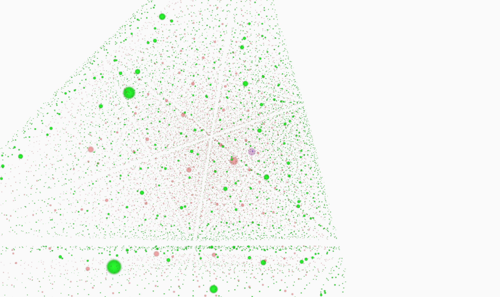
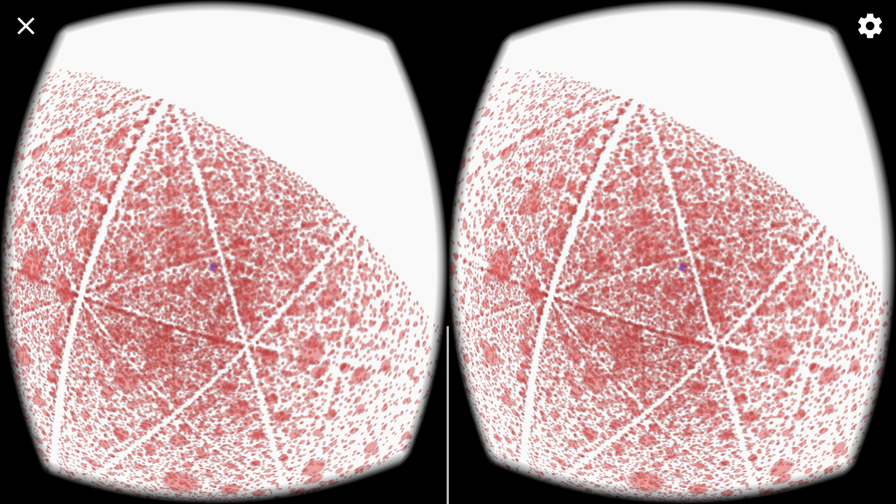

# 3d Cellular Automata

[Live link](http://shur.singh.codes/Cellularity/)

Cellularity is a 3D [cellular automata](https://en.wikipedia.org/wiki/Cellular_automaton) viewer! 
Each cell (dot) can have one of two states: green (alive) or red (dead).
A cell will live or dies based on how many of its 26 immediate neighbors around it are alive or dead, just like [Conway's Game of Life](https://en.wikipedia.org/wiki/Conway%27s_Game_of_Life) but in 3 dimensions! 

## Instructions
Select a pre-made set of rules and dimensions or create your own scenerio by selecting the size of the cube of cells and selecting a series of rules for determining their new state.

## Controls
**ESC** to open the menu

**WASD** to move  
**SHIFT** to sink  
**SPACEBAR** to float up  
**F** to step one iteration  
**G** to animate (quickly as possible)  
**H** to hide dead cells  

The camera is controlled by the mouse and you may directly click on cells to manually change their state.

## Technologies
- [THREE.js](https://threejs.org/) WebGL javascript library
- [WebVr](https://developer.mozilla.org/en-US/docs/Web/API/WebVR_API) experimental VR technology for compatible devices
